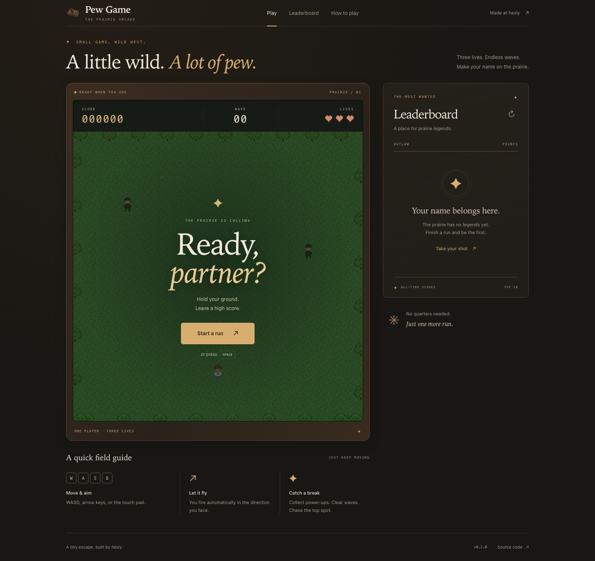

<p align="center">
  
</p>

<h1 align="center">Pew Game</h1>

<p align="center">躲避敌人、收集道具，在浏览器里挑战一波又一波的像素射击。</p>

<p align="center">
  <a href="https://pew.hexly.ai">站点</a> ·
  <a href="docs/README.en.md">English</a>
</p>

## 这是什么

Pew Game 是一款单人浏览器射击游戏，玩法灵感来自《星露谷物语》的 Journey of the Prairie King。玩家控制牛仔在方形场地中移动并自动射击，躲避不断出现的敌人，结束后可以提交分数到排行榜。

页面适配桌面、平板和手机；支持键盘操作，触屏设备会显示方向按钮。界面沿用原始 Logo，以胡桃木色、黄铜色和像素画面呈现西部街机风格。角色、场景和道具像素图由代码绘制，游戏循环独立于 React；页面由 Next.js 静态导出，Cloudflare Worker 提供排行榜 API。



## 功能

- 从 3 条生命开始，受伤后获得短暂无敌时间；敌人数量和生成速度随波次增加。
- 普通、快速和坦克三类敌人，随着波次逐步出现。
- 持续向最后移动方向自动射击，移动时射速略有提高。
- 收集散射、快速射击、穿透和清场道具；前三种效果会在一段时间后结束。
- 使用 1–6 位英文字母或数字名字提交成绩，查看历史前 10 名排行榜。
- 以 320 × 320 的原生游戏坐标绘制，输出至 640 × 640 像素画布，页面显示尺寸随可用空间调整。
- 排行榜连接不可用时可进行明确标记的练习对局；保存失败时保留成绩和表单，方便重试。

## 使用

打开 [Pew Game](https://pew.hexly.ai)，按以下方式游玩：

| 操作 | 按键 / 行为 |
| --- | --- |
| 开始 | 点击 Start a run，或按 Space / Enter |
| 移动和改变射击方向 | WASD、方向键，或按住触屏方向按钮 |
| 射击 | 自动持续射击；停止移动后保留最后方向 |
| 提交分数 | 游戏结束后输入 1–6 位英文字母或数字名字，点击 Save score |
| 再来一局 | 点击 Play again；未保存的本局成绩会被放弃 |

窄屏和具有触摸等粗指针输入的设备会显示方向按钮。已保存成绩或结束练习对局后，也可按 Space / Enter 开始新的一局；有待保存的成绩时，使用 Play again 明确放弃本局。

第 3 波起，击败敌人有机会掉落道具；清场道具从第 5 波起出现。

| 道具 | 效果 |
| --- | --- |
| Spread | 扇形发射 3 发子弹 |
| Rapidfire | 射速翻倍 |
| Pierce | 子弹穿过敌人 |
| Nuke | 清除当前场上敌人 |

排行榜需要连接服务器。开始时若无法获取对局 token，游戏仍可开始，画面会显示 `PRACTICE RUN · SCORES UNAVAILABLE`；该局不能提交排名，下一局会重新尝试连接。正式对局保存失败时，会显示错误并保留名字和成绩，可再次点击 Save score 重试。若服务器已保存但响应未收到，重试会确认同一条记录，不会重复计分。

成绩由客户端上报，服务端检查会话签名、重复提交，以及分数、波次和时长的合理性；它不回放完整对局。

## 开发

需要 Bun 和 Node.js 22.12+。不再需要 Node.js 应用服务器、原生 SQLite 模块或持久卷。

```bash
git clone https://github.com/nocoo/pew-game.git
cd pew-game
bun install --frozen-lockfile
bun run dev
```

`bun run dev` 构建静态页面并在 `http://127.0.0.1:7050` 启动 Wrangler Worker。本机端口通过 nmem 分配；Caddy 将 [pew-game.dev.hexly.ai](https://pew-game.dev.hexly.ai) 直接反向代理到这个 Worker，提供本地 HTTPS。开发调试端口为 `8050`。变更端口前先查询 nmem，并同步 Caddy 配置。

排名使用 Wrangler 的本地 SQLite D1，保存在 `.wrangler/dev`；首次启动自动应用 migrations 并生成独立的本地签名密钥 `.dev.vars.local`。本地配置使用假的 D1 ID，所有命令强制本地运行，不读写线上排名。前端修改后执行 `bun run build` 并刷新；Worker 修改会由 Wrangler 自动重新加载。已有构建可直接用 `bun run start` 启动。

```bash
bun run typecheck       # 生成 Worker Env 类型，检查前端和 Worker
bun run check           # ESLint、单元、游戏循环和本地 D1 集成测试
bun run test:coverage
bun run test:e2e:bdd    # 构建静态页面并进行真实浏览器游戏/排名测试
```

## 部署

站点为 [pew.hexly.ai](https://pew.hexly.ai)。Cloudflare Worker 与独立 D1 数据库均命名为 `pew-game`，资源绑定和域名由 [wrangler.jsonc](wrangler.jsonc) 管理。这个游戏与 `nocoo/pew`、`pew.md` 是不同项目；也不共用 `hexly-status` 数据库。

先用 Wrangler 登录对应账号，并通过交互式命令设置至少 32 字符的独立随机签名密钥。已有部署无需重复更换密钥，更换会使当前对局 token 失效。

```bash
bunx wrangler login
bunx wrangler secret put ANTICHEAT_SECRET --env ""
```

通过仓库质量检查并等待 GitHub CI 成功后部署：

```bash
bun run deploy:check    # 校验 Worker 打包与资源配置，不上线
bun run deploy         # 构建 → 应用生产 D1 migrations → 部署 Worker 和静态资源
```

Worker Static Assets 直接分发导出页面，`/api/*` 由原生 Worker 处理。HMAC 会话签名使用 Worker secret 和 Web Crypto；提交与防重放记录通过 `scores.session_id UNIQUE` 在同一个 D1 事务中落库。相同已签名会话提交相同的规范化名字、分数和波次时，返回原成绩，保留其 ID、时长和创建时间；修改任一项则返回 HTTP 403。响应丢失、重启和并发重试都不会重复记分。排名永久保留，无定时任务；Status 的 7 天监测保留策略不适用于游戏排名。本地 `pew.db` 不会被自动导入。

公开、无需登录的 `GET /api/live` 实际查询 `scores` 表并检查签名密钥是否配置。正常时返回 HTTP 200，D1/表缺失或签名配置不可用时返回 503；返回值为 `{status, version, database: {connected}}`，不暴露内部错误。所有 API 响应均为 `Cache-Control: no-store`。部署后检查主页、`/api/live` 和 `GET /api/scores`；不要向线上写入测试成绩。

## 测试

| 测试层 | 命令 |
| --- | --- |
| 单元、游戏循环和本地 D1 集成测试 | `bun run test` |
| 游戏循环与 Worker/D1 集成测试 | `bun run test:e2e` |
| 浏览器游戏与排名保存 | `bun run test:e2e:bdd` |

浏览器测试前执行 `bunx playwright install chromium`。Playwright 使用 nmem 分配的端口 `27050` 启动静态导出页面及真实 Worker API，调试端口为 `28050`，使用独立的 `.wrangler/browser` SQLite D1；每次测试开始只重置这份本地测试数据。浏览器用例覆盖真实对局结束、保存失败后重试、刷新后的排名持久性，以及排行榜故障重试、键盘开始、练习模式、响应式布局和触屏按钮。D1 集成测试另外使用临时 SQLite 目录，验证迁移、排序、响应丢失后的重试、并发与冲突提交、运行时重启、写入回滚和健康状态，结束后删除临时数据。

```text
src/game/          输入、游戏循环、像素绘图与战斗规则
src/components/    Canvas 容器、成绩表单与排行榜
src/lib/           D1 查询、Web Crypto 签名与成绩校验
worker/index.ts    会话 token、成绩 API 和 /api/live
migrations/        D1 排名 schema
src/__tests__/     单元、游戏循环和本地 D1 集成测试
e2e/bdd/           静态导出 + Worker + SQLite D1 浏览器测试
```

## 技术栈


| 部分 | 实现 |
| --- | --- |
| 游戏 | TypeScript、Canvas 2D、OffscreenCanvas、requestAnimationFrame |
| Web 页面 | Next.js 静态导出、React、Tailwind CSS |
| API 与排行榜 | Cloudflare Workers Static Assets、D1、Web Crypto HMAC |
| 开发与测试 | Bun、ESLint、Vitest、Playwright |

## 文档

- [Logo 使用指南](docs/01-logo-usage.md)
- [项目视觉档案](https://hexly.ai/logos/pew-game)
- [游戏类型与场地定义](src/game/types.ts)

## 许可证

[MIT](LICENSE) © 2026 Zheng Li
